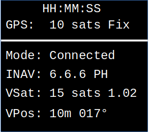

# inav-follow

## Overview

Simple 'follow me' application for INAV. The application runs on a RaspberryPi Pico (rp2040) and requires a NMEA GPS connected to the Pico.

The vehicle requires INAV firmware supporting MSPv2. This is an artificial requirement to simplify the code; the underlying INAV "follow me" functionality e.g. (`GCS_NAV`) has existed since 2016.

A bi-directional MSP capable transparent serial data link is required between the ground control station (GCS) and the vehicle. Examples of suitable data links include 3DR, HC-12 and LoRA based radio systems.

The RP Pico requires a GPS. An old NMEA capable Neo6M is more than adequate. It must provide `$GPGGA` and optionally `$GPRMC`.

In theory, "follow me" is available for all  types of INAV vehicle (`platform type`) that supports stationary `POSHOLD`, e.g. MultiRotor and possibly Rover and Boat. By default, fixed wing is excluded, but this can be changed by configuration.

Optionally, a SSD1306 OLED will be supported (once the author's device is delivered).

## Pico Firmware Configuration

The configurable items are built into the application; it is necessary to rebuild the application to change them. Unless you have some (small) development skills and which to change other things, these are the only items you should change. See the source file `prefs.go`:

``` go
/* user preferences */
const (
	// Baud rate for MSP
	MSPBAUD = 115200
	// Baud rate for GPS
	GPSBAUD = 9600
	// Minimum user sats for follow me
	GPSMINSAT = 6
	// Craft type for no follow (1 = FW); 255 allows anything
	DONT_FOLLOW_TYPE = 1
	// Don't follow if closer than this distance (m), 0 disables this check
	MIN_FOLLOW_DIST float32 = 2.0
    // GPS Time format, either integer seconds or 1 decimal
	GPS_TIME_FORMAT = "15:04:05"
	//GPS_TIME_FORMAT = "15:04:05.0"
)
/* End of user preferences */
```
If the configuration is changed, it is necessary to rebuild / reflash the firmware.

## Pico Hardware Connections

* The GPS is connected to UART0 (pins 1 & 2)
* The MSP serial link is connected to UART1 (pins 11 & 12)
* Optionally, the OLED is connected to I2C1 (SDA pin 31, SCL pin 32)

These may be changed by updating the peripheral device configurations in `main.go`.

## Usage

* Power up the Pico.
* If the Pico is powered / connected via USB, then status information is provided over USB and may be viewed in any serial terminal.
* Status data will be displayed on the OLED.
  * When no valid data is available : "Initialised"
  * Once GPS time is available "HH:MM:SS"
	* GPS Quality (0/1/2), no fix, GPS fix, DGPS fix.
	* Number of satellites
* Once the required number of satellites is reached (`GPSMINSAT` above), then the vehicle is interrogated.
  * If the vehicle is of type `DONT_FOLLOW_TYPE` (typically FW), then follow me is not available.
  * Otherwise, navigation interrogation is started. If navigation mode `HOLD` is reported, and the distance between the vehicle and GCS is greater than `MIN_FOLLOW_DIST`, then follow me data (the required observer / GCS location) is sent to the vehicle.
  * The "follow me" status will be displayed on the OLED.
  * The vehicle will only react to this data if the user has also asserts `GCS NAV` mode. The user may switch between normal `POSHOLD` and "Follow me" by toggling a `GCS NAV` switch on the transmitter.

**Note** that as the vehicle has to be in `POSHOLD` for `GCS NAV` to work, if you experience any issues, disengaging the `GCS NAV` switch will revert to standard `POSHOLD`.

## Installation and Building

A `fl2` file may be provided (in the Release folder) with the default settings shown above. This may be dropped onto the Pico's boot loader mode pseudo-filesystem.

### Build requirements

* `tinygo` compiler (most Linux distros / FreeBSD provide packages or [Github Project releases](https://github.com/tinygo-org/tinygo/releases)) for others.
* Optionally, `make` to automate
* Internet access for required external packages (for first build).

### Make targets

* `make` : (default). Builds `.elf` file (`tinygo build -target pico -size short -o inav-follow.elf`)
* `make flash` : Builds `.elf`, flashes `.uf2` image to device. (`tinygo flash -target pico`)
* `make uf2` : Builds `.elf`, generates `.uf2` using `elf2uf2-rs`. `elf2uf2-rs inav-follow.elf inav-follow.uf2`
* `make clean` : Removes and `.elf` and `.uf2` files.

### Monitor over USB

`tinygo monitor [-port DEVICE_NODE]`

### OLED

It is possible to use a SSD1306 OLED to provide a clue as to what is happening.

The fields are as follows:



* The 1st line shows the attached GPS time
* The 2nd line (**GPS**) shows the local GPS Status (satellites and fix type)
* The 3rd line (**Mode**) shows the INAV connection status
* When connected to INAV, the 4th line (**INAV**) shows the INAV Firmware version and and navigation mode.
* The 5th line (**VSat**) shows the vehicle's (INAV) satellite count and HDOP.
* The 6th Line (**VPos**) shows the distance and bearing from the vehicle to the user.

#### Status

* `Starting` : Application is starting
* `Initialised` : Application ready for GPS input and MSP connection
* `Connecting` : Connecting to FC / MSP (sufficient local satellites / fix)
* `Connected` : Connected to the FC
* `Failed` : FC did not return required information (in particular `FC_VARIANT` == `INAV` or excluded by `DONT_FOLLOW_TYPE`).

#### Navigation Modes

* `Idle` : Not in a navigation mode
* `PH` : Position Hold, application sends WP#255 location which will result in 'follow me' if the pilot also asserts `GCS NAV` mode
* `RTH` : Return to home
* `WP` : Waypoint mission


Note: The image is from an earlier build with some UI elements rearranged.

## Caveat

This application has been bench tested; it has not tested in flight (by the author).

Running against a GPS replay and trivial MSP simulator, it appears to do the right thing.

Note that at the moment, copious debug output is written to any connected USB (USB serial console).

## Simulation Tools

A GPS replayer (`gpsrd`) and a MSP simulator (`followsim`, sufficient for this application only) may be found in the `tools` directory. These require a native `Go` compiler.

## Licence

(c) Jonathan Hudson 2022. 0-BSD.
